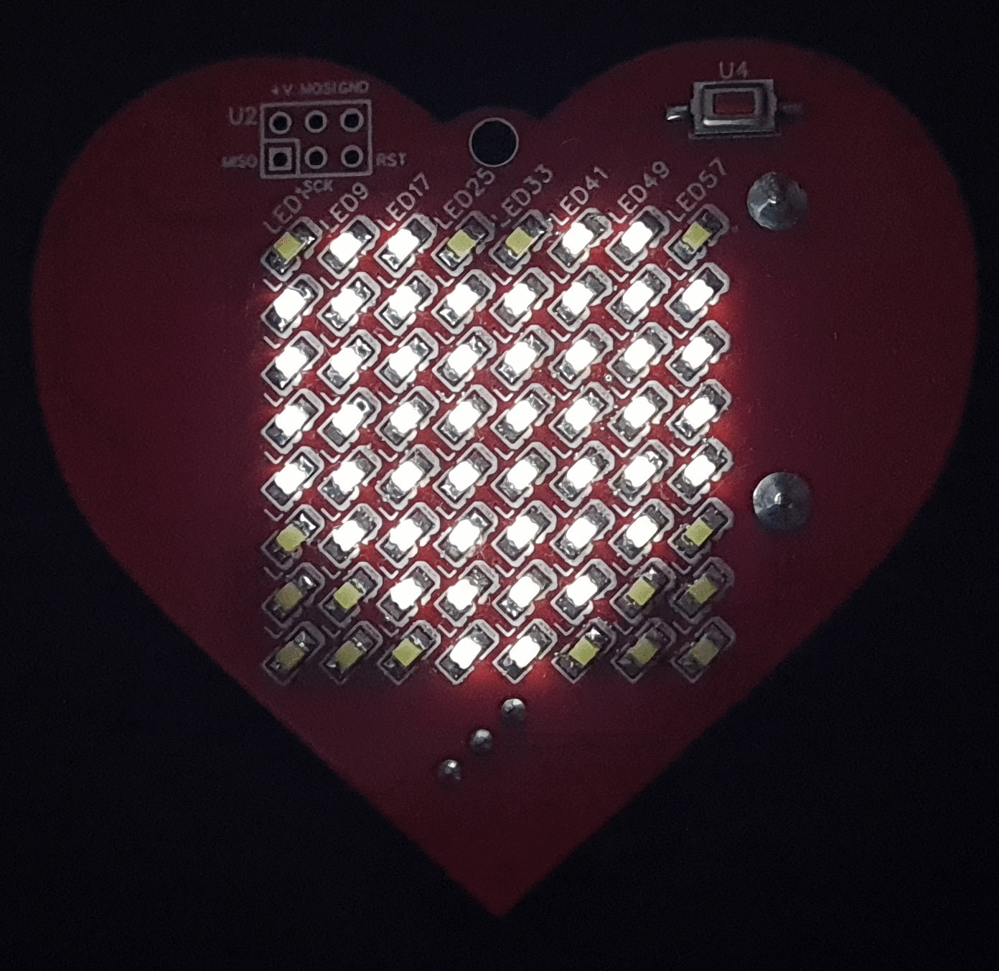
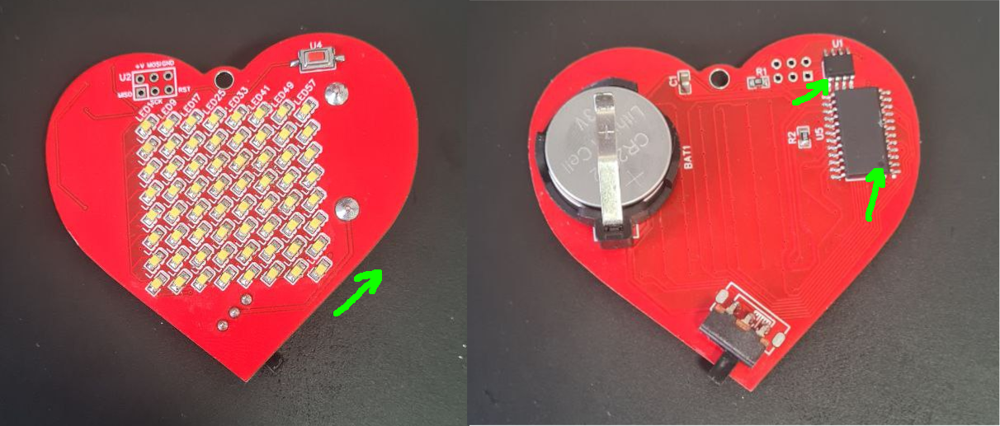

# LED heart

Geek's Valentine card with LED 8x8 pixel display



## Project structure

```
├── README.md
├── img
│   └── *.png
├── bitmap_img                      # files, that will be converted to bitmaps
│   ├── fonts                       # fonts directory
│   │   └── basic                   # "basic" font directory
│   │       ├── font_map.json       # images and letters map
│   │       └── *.png               # letters images
│   └── *.png, *.txt, *.h
├── bitmaps_generate.py             # bitmaps generation script
└── firmware                        # microcontroller firmware (PlatformIO project)
    ├── Makefile
    ├── include
    │   └── bitmaps.h               # automatically generated bitmaps
    ├── lib
    │   └── DisplayMax7219
    │       └── DisplayMax7219.h
    ├── platformio.ini
    └── src
        └── main.cpp
```

## Hardware

| Name                  | Qty | Link                                                            | Description |
|-----------------------|:---:|-----------------------------------------------------------------|-------------|
| Heart-shaped PCB      |  1  | [Gerber files](https://github.com/ralex2304/led-heart/releases) | [EasyEDA project](https://oshwlab.com/ralex2304/led-heart)
| Attiny13A             |  1  | [Aliexpress](https://sl.aliexpress.ru/p?key=cepRG79)            |
| MAX7219               |  1  | [Aliexpress](https://sl.aliexpress.ru/p?key=g8pRG8f)            | LED matrix driver
| 0805 white LED        |  64 | [Aliexpress](https://sl.aliexpress.ru/p?key=8vpRGMu)            |
| CR2032                |  2  | [Aliexpress](https://aliexpress.ru/wholesale?SearchText=CR2032) |
| CR2032 holder         |  1  | [Aliexpress](https://sl.aliexpress.ru/p?key=FppRGal)            | 2 batteries in one holder (3V isn't enough)
| SMD button            |  1  | [Aliexpress](https://sl.aliexpress.ru/p?key=tppRGgy)            | For mode switching
| 10k R0805             |  1  | [Aliexpress](https://sl.aliexpress.ru/p?key=ARpRGFD)            |
| ~500k R0805           |  1  | [Aliexpress](https://sl.aliexpress.ru/p?key=LRpRGwO)            |
| 10uF C0805            |  1  | [Aliexpress](https://sl.aliexpress.ru/p?key=QRpRGBH)            |
| 2 positions switch    |  1  | [Aliexpress](https://sl.aliexpress.ru/p?key=zvpRGuu)            | Power switch

You will need `USBasp` or something similar to upload the firmware.

### Soldering

Soldering 64 LEDs with soldering iron might be quite challenging, so I advise you to get hot air gun and soldering paste.

### SMD nominal values:

| PCB footprint | Nominal value |
|:-------------:|:-------------:|
| `R1`          | `10k`         |
| `R2`          | `~500k`       |
| `C1`          | `10uF`        |

### Order

In my opinion, this soldering order is most convenient:

1. LEDs and button on the face of PCB
2. Attiny13
3. MAX7219
4. SMD components on the back side
5. Power switch and batteries holder

### Polarity

> [!NOTE]
> LED's triangle on its backside must be turned in agreement with footprint on PCB (45° right and up)

Attiny13 and MAX7219 also have polarity. You need to match keys with keys on the footprint.



## Software

### Requirements

- `PlatformIO`
- `Python 3`
- `GNU make`

### Build

To build the firmware run this inside `firmware` directory:

```
make
```

### Uploading firmware

I recommend not to solder ICSP pins (6 pins group at the top of the PCB). It is enough to hold pins manually to upload firmware.

> [!NOTE]
> If your Attiny is new, write fuses firstly (this will set necessary internal oscillator frequency):
>
> ```
> make fuses
> ```

Upload or reupload firmware:

```
make upload
```

### Images and text

Bitmaps are automatically generated from files in `bitmap_img` directory. Each file corresponds to one bitmap. You can add your own there or edit given files. Generated bitmaps are written to header file `firmware/include/bitmaps.h`. Each bitmap is a byte array and has name of source file in caps. For example, bitmap generated from file `example_bmap.txt` will be named `EXAMPLE_BMAP`.

Inside `bitmap_img` there is a `font` directory. Currently there is only one font, called `basic`. It supports English and Russian capital letters, numbers, punctuation marks and some additional symbols. Actually, you can create your custom font. I will give instructions below.

### Custom bitmaps

So, bitmaps can be generated from 3 types of files:

- `.png` -- image will be converted to black and white. White regions are enabled LEDs. Height must be `8` pixels, width `N*8` pixels. `N` - is number of frames. Multiple frames in one bitmap is used for slideshows or blinking animations.
- `.h` -- text from these files will be simply pasted to header file.
- `.txt` -- text for running line mode. File must contain 2 lines:
    1. Font name, e.g. `basic`
    2. Text, e.g. `I love you♥`. Allowed symbols are listed in font map file (`bitmap_img/fonts/<font_name>/font_map.json`.

### Custom font

You can create your font or add symbols to `basic`. In font directory must be a `font_map.json` file. It tells generator what `.png` file it must use for specific symbol.

E.g.
```
"♥": "heart.png",
"+": "plus.png",
"-": "minus.png",
```

Images height must be 8 pixels. Width can be any. Generator puts 1 empty column between symbols, so you don't need to add empty columns to images.

### Bitmaps usage

You can use bitmaps inside of C++ code. The main part is here:

```
firmware/src/main.cpp
=====

    ...

        switch (mode) {
            case 0:     cycle_bitmap( 60, BITMAPS_AND_SIZE(HEART_BLINK));           break;
            case 1:     scroll_bitmap( 7, BITMAP_AND_WIDTH(FOR_SMBDY_WITH_LOVE));   break;
            case 2:     cycle_bitmap( 50, BITMAPS_AND_SIZE(HEART_MINI));            break;
            case 3:     cycle_bitmap( 30, BITMAPS_AND_SIZE(HEART_HALVES));          break;
            case 4:     cycle_bitmap( 30, BITMAPS_AND_SIZE(HEART_MESSAGES));        break;
            default:    mode = 0;                                                   break;
        }

    ...
```

You can add new modes and bitmaps here. There are two types of animations:
- `cycle_bitmap` -- used for slideshows and blink animations. It will sequentially switch bitmaps from array.
- `scroll_bitmap` -- scrolls bitmap column by column. Used for running line text.

First argument is number of frames (`FPS` is set in this file) for one animation step. Second and third arguments are bitmap array and its size. You can add macro `BITMAPS_AND_SIZE` for `cycle_bitmap` and `BITMAP_AND_WIDTH` for `scroll_bitmap`.

